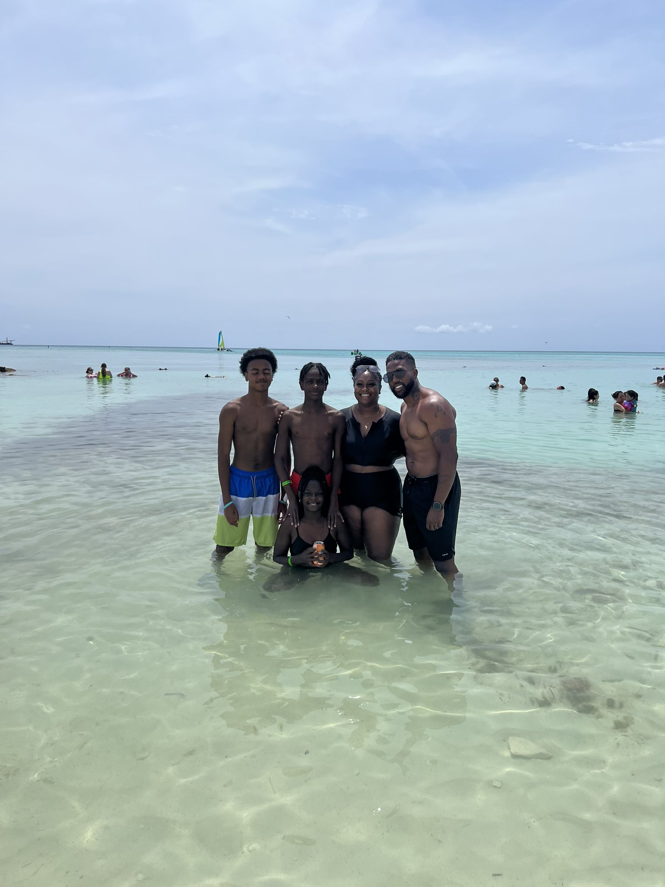

# Drew Cameron
## Hey my name is Drew and im a husband ,father and I unload insights from my perspective in creative ways.

## What I plan to grasp from Savvy Codders Data Anaylytics Course 
*  With data I plan to answers small business owners questions and unload insight on bettering their revenue.
* Unlocking details and insights using data to give perspective fro my side projects within ATD Consulting.
* I am going to master sql, and excell.By working on assignments and not settling for mediocrity
* I will coninue to focus on learning additonal languages and utilizing resources, tableau and python.

[Python In Real Estate]( https://towardsdatascience.com/automating-real-estate-investment-analysis-d2b07395833b)

## Family Over Everything

This picture is my family in Bahamas last summer.I enjoy taking my family on vacations and after Savvy Coders teaches me how to ready and code the matrix I plan on taking them on more vacations.

We've taken a vacation to somewhere with water and sand every year for the past 7 years.

